# Installation
- Es wird eine aktuelle Java Version vorrausgesetzt (z.B. [JRE 17](https://www.oracle.com/java/technologies/downloads/#java17))
- Im selben Ordner der .jar Datei muss sich die sqlite3 Datenbank `database.db` befinden
# Ausführen
- ``java -jar ./java-dhbw-exam.jar`` in der Basis Directory des Projekts
# Nutzung
- Beim Starten ist ein Login nötig, siehe Anmeldedaten
- Man es gibt Kunden und Angestellten Konten, mit verschiedenen GUIs
- Einige Demodaten sind in der Datenbank (database.db) bereits vorhanden.
  - Einige Kundenaccounts
  - 2 Angestellten Accounts
- Kunden können mehrere Konten haben

## Anmeldedaten
| Username | Password      | Role |
|----------|---------------|------|
| 23131    | test          | Employee |
| 77067103 | test          | Client |
| 25063084 | killer        | Client |

---
# Informationen zu externer Software
- Wir verwenden JDBC als Datenbank Java Backend
- Wir verwenden sqlite3 zum Speichern der Daten
- Die Jar Datei ist nicht signiert, damit es bei der Ausführung keine Probleme gibt.

# Klassendiagramme
##### (siehe Directory: Klassendiagramme)

---
#### AccountFactory 
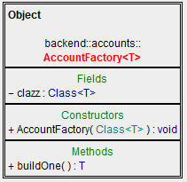
---
#### AdminConsole
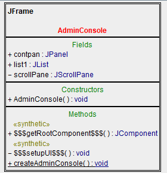
---
#### ChangeCredential
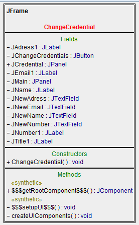
---
#### Client
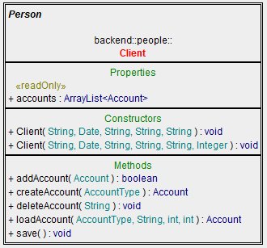
---
#### DatabaseController
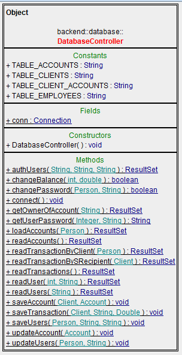
---
#### Employee
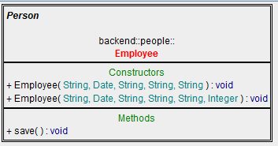
---
#### Gui
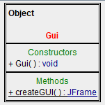
---
#### Main
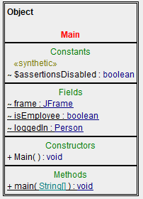
---
#### Person
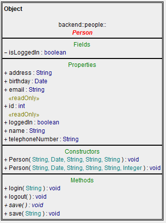
---
#### Transaction
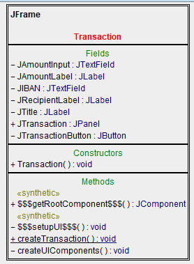
---
#### UserData
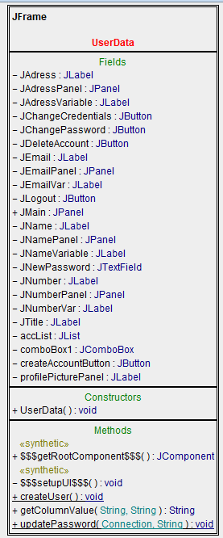
---
#### Account
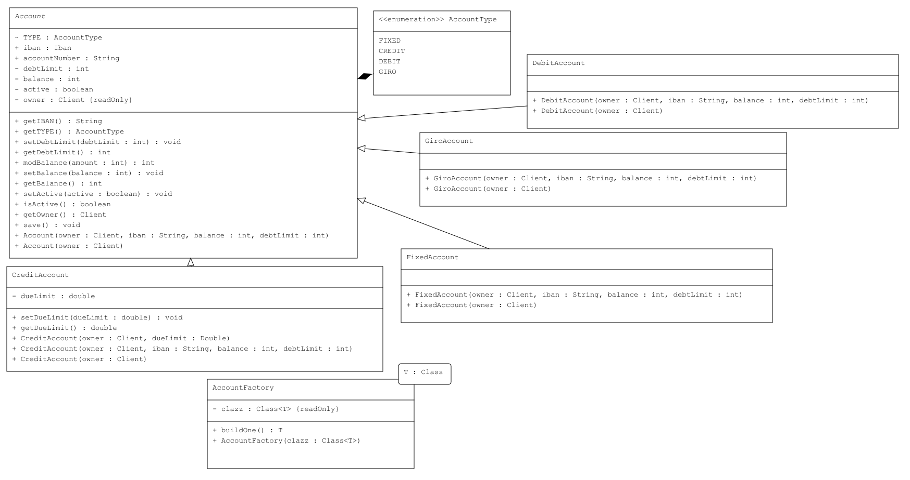